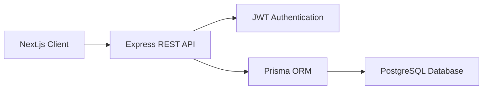
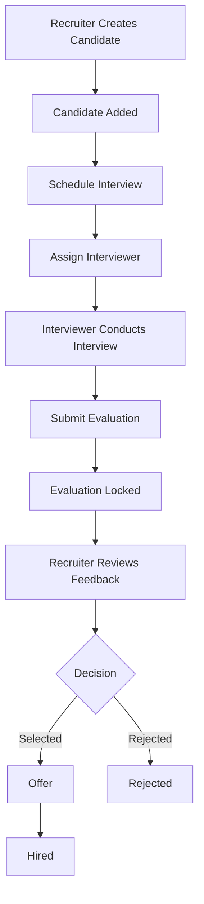
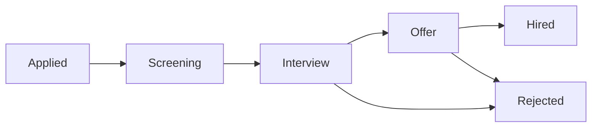
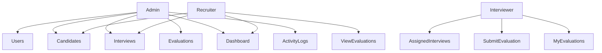
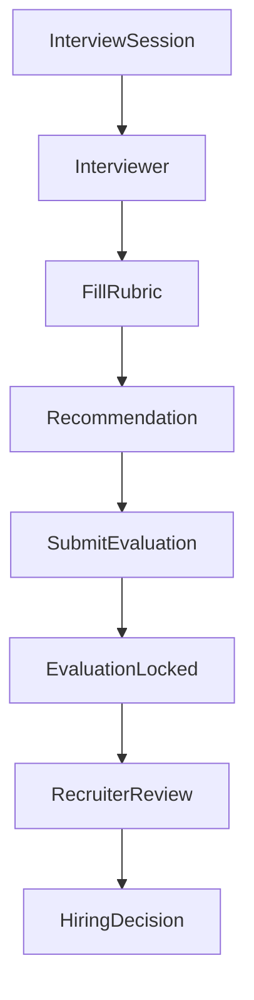

# Interview Evaluation & Candidate Assessment System (IECAS) - Product Requirements Document (PRD)

## Project Overview

**Project Name:** Interview Evaluation & Candidate Assessment System (IECAS)

**Project Type:** Internal Recruitment & Interview Management Platform

**Version:** MVP v1.0

**Status:** In Development

**Backend:** Node.js, Express.js, TypeScript

**Frontend:** Next.js, React, TypeScript

**Database:** PostgreSQL

**ORM:** Prisma ORM

**Authentication:** JWT (Access Token + Refresh Token)

**Deployment:**

* Frontend: Vercel
* Backend: Render
* Database: Neon PostgreSQL

---

## Project Description

Interview Evaluation & Candidate Assessment System (IECAS) is a secure, role-based recruitment management platform designed to simplify and standardize the technical hiring process.

The system enables recruiters to manage candidates, schedule interview sessions, assign interviewers, and track candidate progress throughout the recruitment pipeline. Interviewers can access only their assigned interviews, evaluate candidates using a structured scoring rubric, and submit standardized interview feedback. Administrators have complete visibility across the platform, including user management, audit logs, and system analytics.

Unlike traditional recruitment workflows that rely on spreadsheets, emails, or messaging platforms, IECAS centralizes all interview-related activities into a single platform, ensuring consistency, transparency, and accountability throughout the hiring lifecycle.

---

## Problem Statement

Many organizations continue to manage interview evaluations manually using spreadsheets, emails, and messaging applications. These fragmented workflows often result in delayed feedback, inconsistent candidate assessments, duplicated information, limited visibility into recruitment progress, and a lack of accountability.

Common challenges include:

* Interview feedback is submitted late or lost.
* Different interviewers use inconsistent evaluation criteria.
* Recruiters struggle to monitor candidate progress.
* Candidate information becomes scattered across multiple tools.
* Administrative actions cannot be audited.
* Reporting and recruitment analytics require manual effort.

IECAS addresses these challenges by providing a centralized interview management platform with structured evaluations, secure role-based access, standardized scoring, and complete audit logging.

---

## Project Goals

### Business Goals

* Standardize interview evaluation across all interviewers.
* Reduce manual recruitment management.
* Improve collaboration between recruiters and interviewers.
* Increase transparency in hiring decisions.
* Maintain complete audit history for administrative actions.

### Technical Goals

* Develop a modular and scalable RESTful API.
* Implement secure JWT-based authentication.
* Enforce Role-Based Access Control (RBAC).
* Follow Clean Architecture and feature-based module organization.
* Build a responsive dashboard for each user role.
* Ensure maintainability through TypeScript and Prisma ORM.

---

## Target Users

### Administrator

Responsible for managing the overall recruitment platform.

Primary Responsibilities:

* Manage users and roles
* View all candidates
* Monitor interview activities
* Unlock submitted evaluations
* Access recruitment analytics
* Review system audit logs

---

### Recruiter

Responsible for recruitment operations and candidate management.

Primary Responsibilities:

* Create and manage candidates
* Update recruitment stages
* Schedule interview sessions
* Assign interviewers
* Review submitted evaluations
* Monitor hiring progress

---

### Interviewer

Responsible for conducting interviews and submitting evaluations.

Primary Responsibilities:

* View assigned interview sessions
* Review candidate interview information
* Submit structured evaluations
* Track previously submitted feedback

Interviewers cannot access confidential candidate contact information or modify recruitment records.

---

## Expected Outcome

The final system should provide a complete interview management workflow where recruiters can efficiently organize interviews, interviewers can submit standardized evaluations, administrators can oversee the entire recruitment process, and all critical activities are securely logged for future auditing and reporting.

# 2. Visual Documentation

This section provides high-level visual representations of the system architecture, authentication flow, business workflow, and candidate recruitment pipeline.

---

## System Architecture



---

## JWT Authentication Flow

```mermaid
sequenceDiagram

participant User
participant Client
participant API
participant Database

User->>Client: Login (Email & Password)
Client->>API: POST /api/v1/auth/login

API->>Database: Verify User

Database-->>API: User Found

API-->>Client:
Access Token
Refresh Token

Client->>API:
Protected Request
Authorization: Bearer AccessToken

API->>API:
Verify JWT

API-->>Client:
Protected Resource

Note over Client,API:
When Access Token expires,
Client requests a new Access Token
using the Refresh Token.
```

---

## Business Workflow



---

## Candidate Recruitment Pipeline



---

## User Role Access



---

## Interview Evaluation Flow



---

## Entity Relationship Overview

```text
User
 ├── InterviewSession (Interviewer)
 ├── Evaluation (Author)
 └── ActivityLog (Actor)

Candidate
 ├── InterviewSession
 └── Evaluation

InterviewSession
 ├── Candidate
 ├── Interviewer
 └── Evaluation

Evaluation
 ├── EvaluationScore
 └── RubricCriterion

ActivityLog
 └── entityType + entityId
```

---

## System Modules

```
Authentication
│
├── Login
├── Refresh Token
└── Authorization

User Management
│
├── Users
├── Roles
└── Permissions

Candidate Management
│
├── Candidates
├── Pipeline
└── Resume

Interview Management
│
├── Sessions
├── Scheduling
└── Assignment

Evaluation Module
│
├── Rubric
├── Scores
├── Recommendation
└── Locking

Dashboard
│
├── Statistics
├── Analytics
└── Reports

Activity Log
│
├── Audit Trail
└── System Events
```
# 3. Core Functionality

The Interview Evaluation & Candidate Assessment System (IECAS) consists of six primary modules that work together to streamline the recruitment process from candidate registration to hiring decisions.

---

## 3.1 Authentication & Authorization

The system uses **JWT-based authentication** with **Access Token** and **Refresh Token** to secure API access.

### Features

* User registration (Admin only)
* Secure login with email and password
* JWT Access Token authentication
* Refresh Token generation and renewal
* Logout
* Password hashing using bcrypt
* Protected API routes
* Role-Based Access Control (RBAC)

### User Roles

* **Admin**
* **Recruiter**
* **Interviewer**

---

## 3.2 User Management

Administrators manage all system users and assign appropriate roles.

### Features

* Create new users
* Update user information
* Activate or deactivate users
* Assign user roles
* View user details
* Search and filter users

### User Properties

* Name
* Email
* Password (hashed)
* Role
* Active status
* Last login
* Created date
* Updated date

---

## 3.3 Candidate Management

Recruiters manage candidate information throughout the recruitment lifecycle.

### Features

* Create candidate profiles
* Update candidate information
* Upload resume URL
* Assign applied position
* Update recruitment stage
* Search candidates
* Filter candidates
* Pagination support

### Candidate Properties

* Full name
* Email
* Phone
* Applied position
* Resume URL
* Recruitment stage
* Candidate source
* Created date
* Updated date

### Recruitment Pipeline

* Applied
* Screening
* Interview
* Offer
* Hired
* Rejected

---

## 3.4 Interview Management

Recruiters schedule interviews and assign interviewers to candidates.

### Features

* Schedule interview sessions
* Assign interviewer
* Reschedule interviews
* Cancel interviews
* Mark interviews as completed
* View interview schedule
* Track interview status

### Interview Properties

* Interview type
* Interviewer
* Candidate
* Scheduled start time
* Scheduled end time
* Meeting link
* Location
* Internal notes
* Status

### Interview Status

* Scheduled
* Completed
* Cancelled
* No Show

---

## 3.5 Evaluation Module

Interviewers evaluate candidates using a standardized rubric after completing an interview session.

### Features

* Submit evaluation
* Score predefined criteria
* Add criterion-specific notes
* Add overall feedback
* Provide hiring recommendation
* Lock evaluation after submission
* Admin unlock support

### Evaluation Properties

* Recommendation
* Overall feedback
* Submitted date
* Locked date
* Unlock history

### Recommendation Types

* Strong Yes
* Yes
* No
* Strong No

### Rubric Criteria

* Technical Knowledge
* Problem Solving
* Communication
* System Design
* Coding Quality
* Cultural Fit

Each criterion is scored on a scale of **1–5**.

---

## 3.6 Dashboard

Each user role has access to a customized dashboard displaying relevant information.

### Admin Dashboard

* Total users
* Total candidates
* Total interviews
* Total evaluations
* Pending evaluations
* Recruitment statistics
* Recent activities

### Recruiter Dashboard

* Candidate pipeline
* Upcoming interviews
* Pending interview feedback
* Recently added candidates
* Recruitment progress

### Interviewer Dashboard

* Assigned interviews
* Upcoming interview schedule
* Pending evaluations
* Submitted evaluations

---

## 3.7 Activity Log

The system records critical actions performed by users to maintain a complete audit trail.

### Logged Events

* User created
* User updated
* User role changed
* Candidate created
* Candidate updated
* Candidate stage changed
* Interview scheduled
* Interview updated
* Interview cancelled
* Evaluation submitted
* Evaluation unlocked
* System events

### Log Properties

* Actor
* Action
* Entity type
* Entity ID
* Metadata
* Timestamp

---

## 3.8 Search, Filtering & Pagination

All list-based resources support efficient data retrieval.

### Features

* Keyword search
* Filtering
* Sorting
* Pagination

Supported Resources

* Users
* Candidates
* Interview Sessions
* Evaluations
* Activity Logs

---

## 3.9 Notifications (MVP)

The MVP provides basic system notifications.

### Features

* Interview assignment confirmation
* Evaluation submission confirmation
* Candidate stage update notification

> Email notifications and real-time alerts are planned for future releases.

---

## 3.10 Security Features

The platform follows secure development practices to protect user data.

### Features

* JWT Authentication
* Password hashing with bcrypt
* Role-Based Authorization
* Request validation using Zod
* Global error handling
* Secure HTTP headers
* Protected API endpoints
* Audit logging
* Input sanitization
* Environment variable configuration

# 4. Product Data Model (PRD Style)

This section defines the core business entities of the Interview Evaluation & Candidate Assessment System (IECAS), including their purpose, attributes, relationships, and business constraints.

---

# 1️⃣ User

## Description

A User represents any authenticated person who can access the platform. Every user is assigned a role that determines their permissions within the system.

Supported roles:

* Administrator
* Recruiter
* Interviewer

---

## Attributes

* ID (Unique Identifier)
* Full Name
* Email (Unique)
* Password (Hashed)
* Role
* Active Status
* Last Login
* Created Date
* Updated Date

---

## Relationships

* A User can create **multiple Candidates**.
* A User can create **multiple Interview Sessions** (Recruiter/Admin).
* A User (Interviewer) can be assigned to **multiple Interview Sessions**.
* A User (Interviewer) can submit **multiple Evaluations**.
* A User (Admin) can unlock **multiple Evaluations**.
* A User can generate **multiple Activity Logs**.

---

# 2️⃣ Candidate

## Description

A Candidate represents an applicant participating in the recruitment process.

Recruiters manage candidate information, monitor recruitment progress, and schedule interview sessions.

Candidate contact information is stored securely but is only visible to Recruiters and Administrators.

---

## Attributes

* ID
* Full Name
* Email
* Phone Number
* Applied Position
* Resume URL
* Candidate Source
* Recruitment Stage
* Created Date
* Updated Date

---

## Relationships

* A Candidate can have **multiple Interview Sessions**.
* A Candidate can receive **multiple Evaluations**.
* A Candidate is created by **one User**.

---

# 3️⃣ Interview Session

## Description

An Interview Session represents a scheduled interview between a Candidate and an Interviewer.

Each interview session is assigned to exactly one interviewer and can produce at most one evaluation.

---

## Attributes

* ID
* Candidate
* Interviewer
* Interview Type
* Scheduled Start Time
* Scheduled End Time
* Meeting Link
* Interview Location
* Internal Notes
* Status
* Created Date
* Updated Date

---

## Relationships

* An Interview Session belongs to **one Candidate**.
* An Interview Session is assigned to **one Interviewer**.
* An Interview Session is created by **one Recruiter/Admin**.
* An Interview Session has **zero or one Evaluation**.

---

# 4️⃣ Evaluation

## Description

An Evaluation represents the interview feedback submitted by an Interviewer after completing an Interview Session.

Each evaluation follows a standardized scoring rubric and includes an overall hiring recommendation.

Once submitted, an evaluation becomes locked. Only an Administrator can unlock it, and every unlock action is recorded in the audit log.

---

## Attributes

* ID
* Recommendation
* Overall Feedback
* Submitted Date
* Locked Date
* Unlocked Date
* Unlock Reason
* Created Date
* Updated Date

---

## Relationships

* An Evaluation belongs to **one Interview Session**.
* An Evaluation belongs to **one Candidate**.
* An Evaluation is authored by **one Interviewer**.
* An Evaluation contains **multiple Evaluation Scores**.

---

# 5️⃣ Rubric Criterion

## Description

A Rubric Criterion defines a standardized evaluation category used during candidate assessment.

The system ships with a fixed set of criteria for the MVP to ensure consistent evaluations across interviewers.

---

## Default Criteria

* Technical Knowledge
* Problem Solving
* Coding Quality
* Communication
* System Design
* Cultural Fit

---

## Attributes

* ID
* Key
* Label
* Description
* Display Order
* Active Status
* Created Date
* Updated Date

---

## Relationships

* One Rubric Criterion can be used in **multiple Evaluation Scores**.

---

# 6️⃣ Evaluation Score

## Description

An Evaluation Score stores the score and optional comments for a single rubric criterion within an Evaluation.

Each criterion is scored only once per evaluation.

---

## Attributes

* ID
* Score (1–5)
* Criterion Note
* Created Date
* Updated Date

---

## Relationships

* An Evaluation Score belongs to **one Evaluation**.
* An Evaluation Score belongs to **one Rubric Criterion**.

---

# 7️⃣ Activity Log

## Description

An Activity Log records important actions performed within the system for auditing, troubleshooting, and administrative monitoring.

The log uses a polymorphic reference (`entityType` + `entityId`) to associate actions with different entities such as Candidates, Interview Sessions, Evaluations, or Users.

---

## Attributes

* ID
* Actor
* Action
* Entity Type
* Entity ID
* Metadata (JSON)
* Request ID (Optional)
* Created Date

---

## Relationships

* An Activity Log belongs to **one User (Actor)**.
* An Activity Log references **one business entity** using `entityType` and `entityId`.

---

# 🔗 Relationship Summary

* One **User** → can create many **Candidates**
* One **User** → can create many **Interview Sessions**
* One **Interviewer** → can conduct many **Interview Sessions**
* One **Interviewer** → can submit many **Evaluations**
* One **Admin** → can unlock many **Evaluations**
* One **Candidate** → can have many **Interview Sessions**
* One **Candidate** → can receive many **Evaluations**
* One **Interview Session** → belongs to one **Candidate**
* One **Interview Session** → belongs to one **Interviewer**
* One **Interview Session** → has **zero or one Evaluation**
* One **Evaluation** → belongs to one **Interview Session**
* One **Evaluation** → belongs to one **Candidate**
* One **Evaluation** → contains many **Evaluation Scores**
* One **Rubric Criterion** → can appear in many **Evaluation Scores**
* One **Activity Log** → belongs to one **User (Actor)** and references a single business entity.

---

# 📋 Business Constraints

* Only **Administrators** can manage users.
* Only **Recruiters** and **Administrators** can create candidates.
* Only **Recruiters** can schedule interview sessions.
* One interview session can have **only one interviewer**.
* One interview session can have **only one evaluation**.
* Only the assigned interviewer can submit an evaluation.
* Evaluations are automatically locked after submission.
* Only an Administrator can unlock an evaluation.
* Candidate contact information is visible only to Recruiters and Administrators.
* Every important system action must be recorded in the Activity Log.

# 5. API Endpoints

All endpoints follow RESTful conventions and are versioned using the `/api/v1` prefix.

Authentication is handled using **JWT Access Token** and **Refresh Token**.

---

# Authentication

| Method | Endpoint                     | Description                      |
| ------ | ---------------------------- | -------------------------------- |
| POST   | `/api/v1/auth/register`      | Register a new user (Admin only) |
| POST   | `/api/v1/auth/login`         | Login with email and password    |
| POST   | `/api/v1/auth/refresh-token` | Generate a new access token      |
| POST   | `/api/v1/auth/logout`        | Logout current user              |
| GET    | `/api/v1/auth/me`            | Get currently authenticated user |

---

# Users

| Method | Endpoint                   | Description                | Authorization |
| ------ | -------------------------- | -------------------------- | ------------- |
| POST   | `/api/v1/users`            | Create a new user          | Admin         |
| GET    | `/api/v1/users`            | Get all users              | Admin         |
| GET    | `/api/v1/users/:id`        | Get user by ID             | Admin         |
| PATCH  | `/api/v1/users/:id`        | Update user information    | Admin         |
| PATCH  | `/api/v1/users/:id/status` | Activate / Deactivate user | Admin         |
| DELETE | `/api/v1/users/:id`        | Delete user (Soft Delete)  | Admin         |

---

# Candidates

| Method | Endpoint                       | Description              | Authorization    |
| ------ | ------------------------------ | ------------------------ | ---------------- |
| POST   | `/api/v1/candidates`           | Create candidate         | Recruiter, Admin |
| GET    | `/api/v1/candidates`           | Get all candidates       | Recruiter, Admin |
| GET    | `/api/v1/candidates/:id`       | Get candidate details    | Recruiter, Admin |
| PATCH  | `/api/v1/candidates/:id`       | Update candidate         | Recruiter, Admin |
| PATCH  | `/api/v1/candidates/:id/stage` | Update recruitment stage | Recruiter, Admin |
| DELETE | `/api/v1/candidates/:id`       | Archive candidate        | Recruiter, Admin |

---

# Interview Sessions

| Method | Endpoint                                | Description                   | Authorization                          |
| ------ | --------------------------------------- | ----------------------------- | -------------------------------------- |
| POST   | `/api/v1/interview-sessions`            | Schedule interview            | Recruiter                              |
| GET    | `/api/v1/interview-sessions`            | Get interview sessions        | Recruiter, Admin                       |
| GET    | `/api/v1/interview-sessions/:id`        | Get interview session details | Recruiter, Admin, Assigned Interviewer |
| PATCH  | `/api/v1/interview-sessions/:id`        | Update interview session      | Recruiter                              |
| PATCH  | `/api/v1/interview-sessions/:id/status` | Update session status         | Recruiter                              |
| DELETE | `/api/v1/interview-sessions/:id`        | Cancel interview session      | Recruiter                              |

---

# Evaluations

| Method | Endpoint                         | Description            | Authorization            |
| ------ | -------------------------------- | ---------------------- | ------------------------ |
| POST   | `/api/v1/evaluations`            | Submit evaluation      | Assigned Interviewer     |
| GET    | `/api/v1/evaluations`            | Get evaluations        | Recruiter, Admin         |
| GET    | `/api/v1/evaluations/:id`        | Get evaluation details | Recruiter, Admin, Author |
| PATCH  | `/api/v1/evaluations/:id/unlock` | Unlock evaluation      | Admin                    |
| PATCH  | `/api/v1/evaluations/:id/relock` | Re-lock evaluation     | Admin                    |

---

# Rubric Criteria

| Method | Endpoint                  | Description             | Authorization      |
| ------ | ------------------------- | ----------------------- | ------------------ |
| GET    | `/api/v1/rubric-criteria` | Get all rubric criteria | Authenticated User |

> **MVP Note:** Rubric criteria are fixed and cannot be created, updated, or deleted through the API.

---

# Dashboard

| Method | Endpoint                        | Description                | Authorization |
| ------ | ------------------------------- | -------------------------- | ------------- |
| GET    | `/api/v1/dashboard/admin`       | Admin dashboard statistics | Admin         |
| GET    | `/api/v1/dashboard/recruiter`   | Recruiter dashboard        | Recruiter     |
| GET    | `/api/v1/dashboard/interviewer` | Interviewer dashboard      | Interviewer   |

---

# Activity Logs

| Method | Endpoint                    | Description              | Authorization |
| ------ | --------------------------- | ------------------------ | ------------- |
| GET    | `/api/v1/activity-logs`     | Get all activity logs    | Admin         |
| GET    | `/api/v1/activity-logs/:id` | Get activity log details | Admin         |

---

# Query Parameters

The following endpoints support query parameters:

* `GET /users`
* `GET /candidates`
* `GET /interview-sessions`
* `GET /evaluations`
* `GET /activity-logs`

### Pagination

| Parameter | Description                |
| --------- | -------------------------- |
| page      | Current page number        |
| limit     | Number of records per page |

---

### Sorting

| Parameter | Description |
| --------- | ----------- |
| sortBy    | Field name  |
| sortOrder | asc / desc  |

---

### Searching

| Parameter  | Description    |
| ---------- | -------------- |
| searchTerm | Keyword search |

---

### Filtering

Example:

```http
GET /api/v1/candidates?stage=INTERVIEW
```

```http
GET /api/v1/interview-sessions?status=SCHEDULED
```

```http
GET /api/v1/users?role=INTERVIEWER
```

---

# Authentication Strategy

Protected endpoints require a valid JWT Access Token.

Example:

```http
Authorization: Bearer <access_token>
```

If the Access Token expires, clients must call:

```http
POST /api/v1/auth/refresh-token
```

to obtain a new Access Token using a valid Refresh Token.

---

# Standard Response Format

## Success Response

```json
{
  "success": true,
  "message": "Request completed successfully.",
  "meta": {
    "page": 1,
    "limit": 10,
    "total": 100
  },
  "data": {}
}
```

---

## Error Response

```json
{
  "success": false,
  "message": "Validation failed.",
  "errorSources": [
    {
      "path": "email",
      "message": "Email already exists."
    }
  ],
  "stack": "Visible only in development mode."
}
```
